---
#Front matter (metadata).
abstract:  Add SSO to a ReactJS based app using Security Verify 

authors:                # REQUIRED - Note: can be one or more
  - name: Shikha Maheshwari
    email: shikha.mah@in.ibm.com
  - name: Balaji Kadambi
    email: bkadambi@in.ibm.com

completed_date:         # REQUIRED - Note: date format is YYYY-MM-DD

components:
# For a full list of options see https://github.ibm.com/IBMCode/Definitions/blob/master/components.yml
# Use the "slug" value found at the link above to include it in this content.
# Example (remove the # to uncomment):
 # - "aix"

draft: true|false       # REQUIRED

excerpt:     Add SSO to a ReactJS based app using Security Verify 

keywords:              security verify, security, sso

last_updated:           # REQUIRED - Note: date format is YYYY-MM-DD

primary_tag:         "security"  

pta:                     "cloud, container, and infrastructure"
# For a full list of options see https://github.ibm.com/IBMCode/Definitions/blob/master/primary-technology-area.yml
# Use the "slug" value found at the link above to include it in this content.
# Example (remove the # to uncomment):
 # - "cloud, container, and infrastructure"

pwg:                    "security"
# For a full list of options see https://github.ibm.com/IBMCode/Definitions/blob/master/portfolio-working-group.yml
# Use the "slug" value found at the link above to include it in this content.
# Example (remove the # to uncomment):
# - "containers"

related_content:        # OPTIONAL - Note: zero or more related content
  - type: announcements|articles|blogs|patterns|series|tutorials|videos
    slug:

related_links:           # OPTIONAL - Note: zero or more related links

runtimes:               # OPTIONAL - Note: Select runtimes from the complete set of runtimes below. Do not create new runtimes. Only use runtimes specifically in use by your content.
# For a full list of options see https://github.ibm.com/IBMCode/Definitions/blob/master/runtimes.yml
# Use the "slug" value found at the link above to include it in this content.
# Example (remove the # to uncomment):
- "liberty for java"

series:                 # OPTIONAL
 - type:
   slug:

services:               # OPTIONAL - Note: please select services from the complete set of services below. Do not create new services. Only use services specifically in use by your content.
# For a full list of options see https://github.ibm.com/IBMCode/Definitions/blob/master/services.yml
# Use the "slug" value found at the link above to include it in this content.
# Example (remove the # to uncomment):
- "security-verify"

subtitle:               Provide a single point access to enterprise applications and monitor their usage

tags:
# Please select tags from the complete set of tags below. Do not create new tags. Only use tags specifically targeted for your content. If your content could match all tags (for example cloud, hybrid, and on-prem) then do not tag it with those tags. Less is more.
# For a full list of options see https://github.ibm.com/IBMCode/Definitions/blob/master/tags.yml
# Use the "slug" value found at the link above to include it in this content.
# Example (remove the # to uncomment):
 # - "blockchain"

title:                  Add SSO to a ReactJS based app using Security Verify 
translators:             # OPTIONAL - Note: can be one or more
  - name:
    email:

type: tutorial|howto    # REQUIRED

---

[IBM Security Verify](https://www.ibm.com/products/verify-for-workforce-iam) provides identity-as-a-service for every user, including Single sign-on(SSO), risk-based Multi factor authentication(MFA) and adaptive access, user lifecycle management, and identity analytics. 

Security Verify includes `SAML` and `OIDC` cloud based federated single sign-on with connectors. In this tutorial, you will learn how to to make the required connection for your custom application using the OpenID Connect (OIDC) single sign-on protocol.

`OpenID Connect v1.0 (OIDC)` is a modern standard for web single sign-on. It adds an identity layer to the `OAuth 2.0` standard. These standards are popular because they have simple client-side implementations, making it easy for you to get connected. The standards support different grant types for different use cases. For web applications, the `Authorization code` grant type is the most commonly used and most widely supported. We will use the `Authorization code` grant type for this tutorial.

This tutorial covers the below aspects:

- Adding and configure a custom application on Security Verify for SSO  
The custom application can be deployed anywhere - On-premise or on any Cloud provider. We will run an application locally for this tutorial to demonstrate the procedure which would remain the same irrespective of where the application is deployed. The custom application is registered with Security Verify.

- Enable and Configure verify-sdk for a ReactJS based application  
In this tutorial, we demonstrate a strategy to use [verify-sdk](https://docs.verify.ibm.com/verify/docs/verify-sdk) with a ReactJS app.

- Set up Authentication for login path on sample application  
For this tutorial, we will download and configure a sample application available [here](https://github.com/IBM/security-verify-reactjs-tutorial). This configuration would re-direct the request to `Security Verify` for authentication.

- Protect other paths on the application using token introspection with Security Verify  
The sample tutorial application has two other microservices as part of the solution - weather service and user info service. The weather service is a Node.js microservice and user info service is a Java microservice. The APIs exposed by both these services are protected. Once an user is authenticated with Security Verify, an access token is retrieved. This access token is sent back to the browser and stored as a secure cookie. This cookie is sent to the server for all other subsequent API calls. In the API implementations, the token is introspected with Security Verify for validity. If the token is valid, the API access is allowed else the access is rejected.

- Monitor the usage of the application on Security Verify  
The Security Verify Dashboard can be used to generate reports on the application usage with details of number of user logins. The logins can be further analyzed to check for successful and unsuccessul login attempts.

# Add SSO to a ReactJs based app using Security Verify 

## Prerequisites

[IBM Security Verify account](https://www.ibm.com/account/reg/in-en/signup?formid=urx-30041)

[Maven](https://maven.apache.org/)

[Java](https://www.oracle.com/in/java/technologies/javase-downloads.html)

[Git client](https://git-scm.com/downloads)

[OpenShift CLI](https://docs.openshift.com/container-platform/4.7/cli_reference/openshift_cli/getting-started-cli.html)

## Estimated time

Completing this tutorial should take about 30 minutes.

## Steps

### Add a custom application on Security Verify

Login to Security Verify. Select `Applications` from the menu.

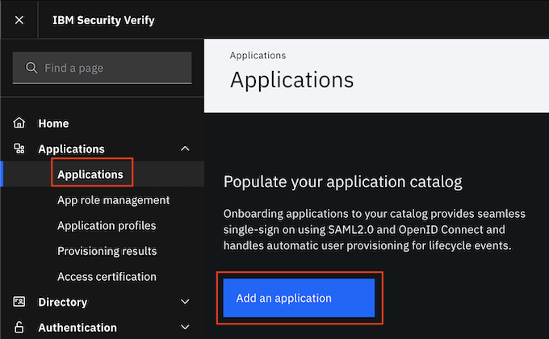

Click on `Add application` to add an application.

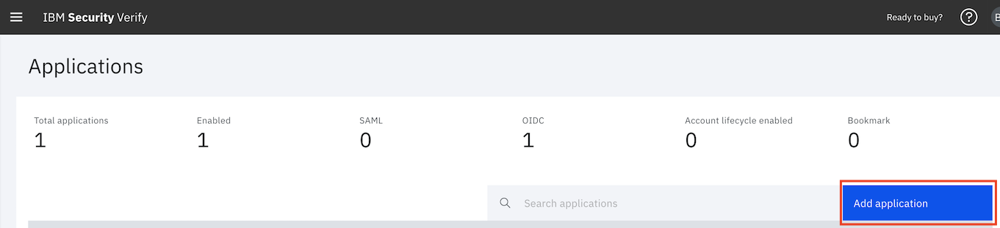

Select the application type as `Custom Application`. Click on `Add application`.

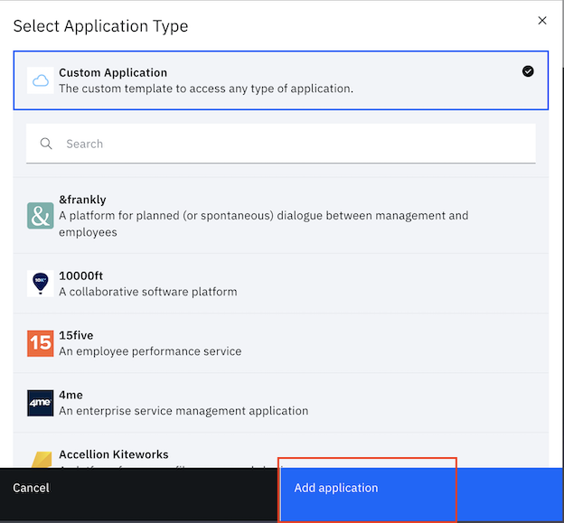

Enter a name for the application and a `Company name`.

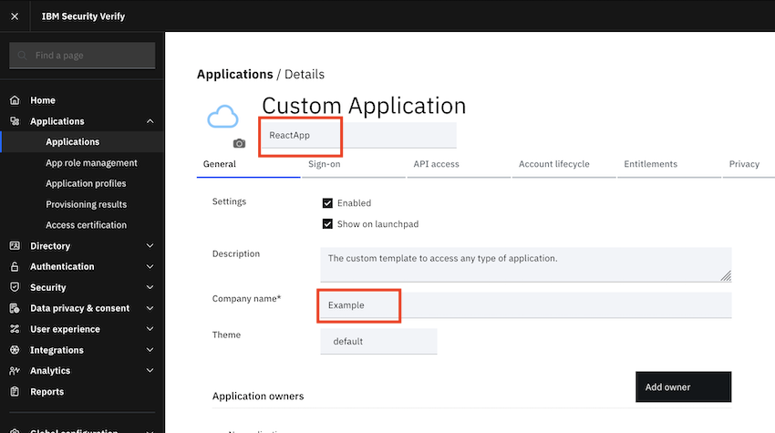

You will now configure SSO using the [OpenID Connect](https://openid.net/connect/) based authentication with `Authorization code` scheme. Click on the `Sign-on` tab. Configure as follows:
- Enter a name for the app say `Liberty App`
- Select the `Sign-on method` as `Open ID Connect 1.0`. 
- Enter the `Application URL` as `<TODO>`.
- Choose `Grant types` as `Authorization code`.
- Unselect the option `Require proof key for code exchange (PKCE) verification`.
- Enter `Redirect URIs` as `<TODO>`.
Click on `Save` to save the configuration.

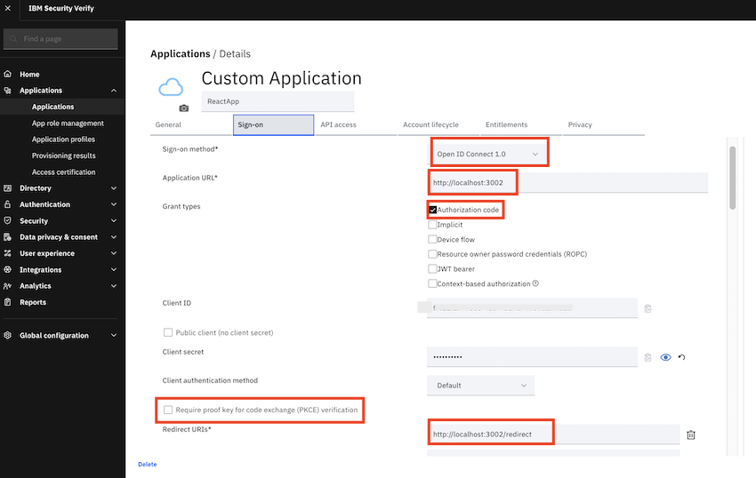

Select `Access Type` as `Automatic access for all users and groups`. Click on `Save`.

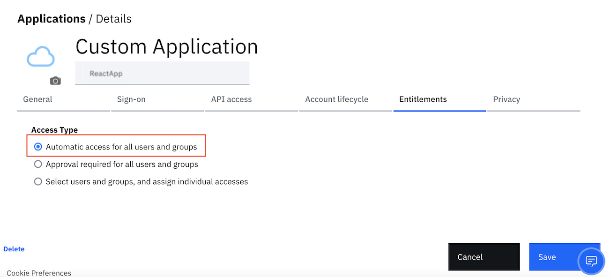

Go to `Applications` menu and select the row with the  newly created `Liberty App`. Click the `Settings` icon.

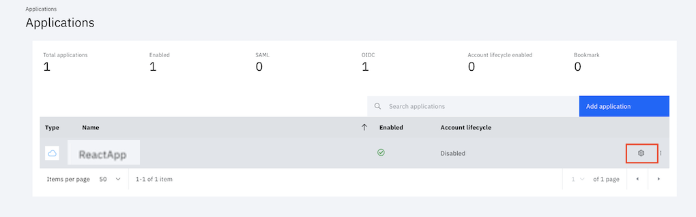

Goto the `Sign-on` tab. Note down the below:
- `Client ID` 
- `Client secret`.

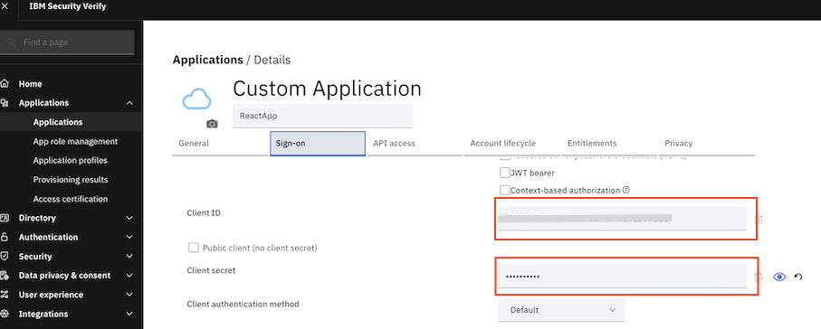

Next, note down the ` IBM Security Verify endpoint`.

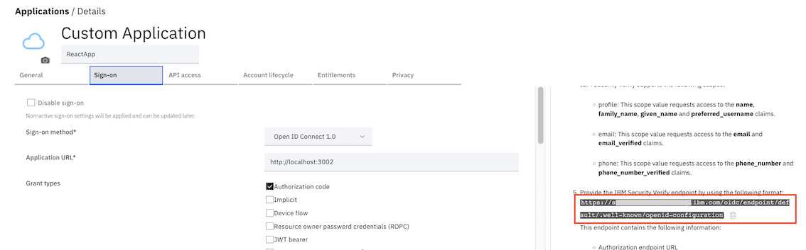

Open the `IBM Security Verify endpoint` in a new browser tab. Note down the below endpoints:
- `introspection_endpoint`
- `authorization_endpoint`
- `token_endpoint`
- `userinfo_endpoint`.

### Add a new user to Security Verify

Next go to `Users & Groups` to add a new user. Click on `Add user`.

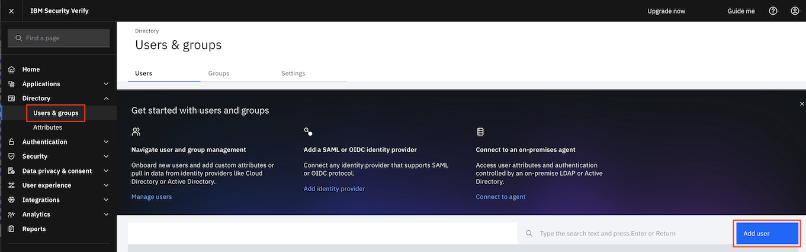

Select `Identity source` as `Cloud Directory`. Enter values for `Given name` and `Surname`. Enter any valid e-mail address for `Work e-mail`. Click on `Save`.

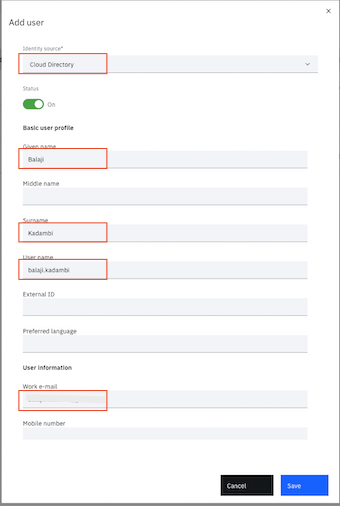

Check your e-mail for a confirmation mail from Security Verify. The email contains a temporary password and a link to login to Security Verify. Login to Security Verify and change your password.

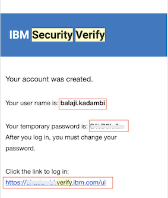

Intro:
This tutorial will help you to understand the ...

Steps:

1. Security Verify Setup
2. Build & Deploy user management service
3. Build & Deploy weather api 

**4. Build & Deploy frontend gateway service**

When we create a react app, it runs on its own server (express). You can configure any other server of your choice as well like apollo. You can navigate to different components in React app using React Router mechanism. If you need to call any backend APIs from your react pages, then you can achieve it in two ways - either embed the backend API call in your React pages itself or use a gateway service to call other APIs and using proxy your react pages can call gateway service APIs. In microservices based architecture, having gateway service in between is recommended as it provides more flexibility to handle the changes in API call. In this case your UI application and gateway service runs as two different applications. Running multiple applications during development phase is fine but for production it is good to be bundled as one application which ease out the process of maintenance and increases performance too. Read this [blog](https://www.ibm.com/cloud/blog/react-web-express-api-development-production) for more information.

To integrate React UI with security verify,  we need to do login using security verify page and then come back to React UI.
Here in this tutorial, the UI code is available at `sources/frontend-gateway-svc/ui-react`. 

