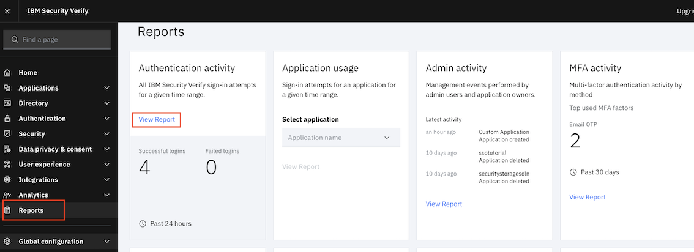
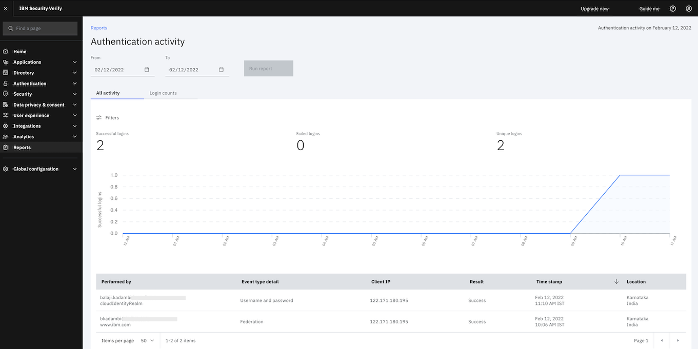

---
#Front matter (metadata).
abstract:  Add SSO to a ReactJS based application using IBM Security Verify 

authors:                # REQUIRED - Note: can be one or more
  - name: Shikha Maheshwari
    email: shikha.mah@in.ibm.com
  - name: Balaji Kadambi
    email: bkadambi@in.ibm.com

completed_date:         # REQUIRED - Note: date format is YYYY-MM-DD

components:
# For a full list of options see https://github.ibm.com/IBMCode/Definitions/blob/master/components.yml
# Use the "slug" value found at the link above to include it in this content.
# Example (remove the # to uncomment):
 # - "aix"

draft: true|false       # REQUIRED

excerpt:     Add SSO to a ReactJS based application using IBM Security Verify 

keywords:              security verify, security, sso

last_updated:           # REQUIRED - Note: date format is YYYY-MM-DD

primary_tag:         "security"  

pta:                     "cloud, container, and infrastructure"
# For a full list of options see https://github.ibm.com/IBMCode/Definitions/blob/master/primary-technology-area.yml
# Use the "slug" value found at the link above to include it in this content.
# Example (remove the # to uncomment):
 # - "cloud, container, and infrastructure"

pwg:                    "security"
# For a full list of options see https://github.ibm.com/IBMCode/Definitions/blob/master/portfolio-working-group.yml
# Use the "slug" value found at the link above to include it in this content.
# Example (remove the # to uncomment):
# - "containers"

related_content:        # OPTIONAL - Note: zero or more related content
  - type: announcements|articles|blogs|patterns|series|tutorials|videos
    slug:

related_links:           # OPTIONAL - Note: zero or more related links


runtimes:               # OPTIONAL - Note: Select runtimes from the complete set of runtimes below. Do not create new runtimes. Only use runtimes specifically in use by your content.
# For a full list of options see https://github.ibm.com/IBMCode/Definitions/blob/master/runtimes.yml
# Use the "slug" value found at the link above to include it in this content.
# Example (remove the # to uncomment):
- "liberty for java"

series:                 # OPTIONAL
 - type:
   slug:

services:               # OPTIONAL - Note: please select services from the complete set of services below. Do not create new services. Only use services specifically in use by your content.
# For a full list of options see https://github.ibm.com/IBMCode/Definitions/blob/master/services.yml
# Use the "slug" value found at the link above to include it in this content.
# Example (remove the # to uncomment):
- "security-verify"

subtitle:               Provide a single point access to enterprise applications and monitor their usage

tags:
# Please select tags from the complete set of tags below. Do not create new tags. Only use tags specifically targeted for your content. If your content could match all tags (for example cloud, hybrid, and on-prem) then do not tag it with those tags. Less is more.
# For a full list of options see https://github.ibm.com/IBMCode/Definitions/blob/master/tags.yml
# Use the "slug" value found at the link above to include it in this content.
# Example (remove the # to uncomment):
 # - "blockchain"

title:                  Add SSO to a ReactJS based application using IBM Security Verify 
translators:             # OPTIONAL - Note: can be one or more
  - name:
    email:

type: tutorial|howto    # REQUIRED

---

[React](https://reactjs.org/) is a JavaScript library for building user interfaces and is used to build single-page applications. [SSO(Single Sign-on)](https://en.wikipedia.org/wiki/Single_sign-on) is an authentication scheme that allows the user to log in once and access services without re-entering passwords. [IBM Security Verify](https://www.ibm.com/products/verify-for-workforce-iam) provides identity-as-a-service for every user, including Single sign-on(SSO), risk-based Multi factor authentication(MFA) and adaptive access, user lifecycle management, and identity analytics. In this tutorial, you will learn how to add SSO feature in your React application using the IBM Security Verify.

Security Verify includes `SAML` and `OIDC` cloud based federated single sign-on with connectors. [OpenID Connect v1.0 (OIDC)](https://openid.net/connect/) is a modern standard for web single sign-on. It adds an identity layer to the `OAuth 2.0` standard. These standards are popular because they have simple client-side implementations, making it easy for you to get connected. The standards support different grant types for different use cases. For web applications, the `Authorization code` grant type is the most commonly used and most widely supported. We will use the `Authorization code` grant type for this tutorial.

The tutorial covers the below aspects:

- Create a sample microservices based application using React for front-end service

  The sample application contains three microservices:

    (a) Front-end UI service built using React that interacts with back-end services

    (b) Weather service built on Node.js that returns the weather information for a provided location

    (c) User information service built on Open Liberty with Java that returns user details stored in Security Verify

    The application code is provided [here](https://github.com/IBM/security-verify-reactjs-tutorial).

- Enable and configure verify-sdk for the React application to enable authentication <br/>
In this tutorial, we demonstrate a strategy to use [verify-sdk](https://docs.verify.ibm.com/verify/docs/verify-sdk) with the React app. This configuration would re-direct the request to `Security Verify` for authentication.

- Adding and configure the application on IBM Security Verify for SSO <br/>
The application can be deployed anywhere - On-premise or on any Cloud provider. We will deploy the application on OpenShift(on IBM Cloud) for this tutorial to demonstrate the procedure. The configuration steps would remain the same irrespective of the cloud provider. The application will be registered with Security Verify.

- Protect other paths on the application using token introspection with Security Verify <br/>
The sample application has two other microservices as part of the solution - weather service and user info service. The weather service is a Node.js microservice and user info service is a Java microservice. The APIs exposed by both these services are protected. Once an user is authenticated with Security Verify, an access token is retrieved. This access token is sent back to the browser and stored as a secure cookie. This cookie is sent to the server for all other subsequent API calls. In the API implementations, the token is introspected with Security Verify for validity. If the token is valid, the API access is allowed else the access is rejected.

- Monitor the usage of the application on Security Verify <br/>
The Security Verify Dashboard can be used to generate reports on the application usage with details of number of user logins. The logins can be further analyzed to check for successful and unsuccessul login attempts.

## Prerequisites

* Sign-up for [IBM Cloud Account](https://cloud.ibm.com). It is required if you plan to create OpenShift Cluster on IBM Cloud.

* [OpenShift Cluster](https://cloud.ibm.com/kubernetes/catalog/create?platformType=openshift). Need an OpenShift cluster to deploy the application.

* Create an [IBM Security Verify account](https://www.ibm.com/account/reg/in-en/signup?formid=urx-30041)

* [Git client](https://git-scm.com/downloads)

* [OpenShift CLI](https://docs.openshift.com/container-platform/4.7/cli_reference/openshift_cli/getting-started-cli.html)

## Estimated time

Completing this tutorial should take about 45 minutes.

## Steps

### 1. Add a custom application on Security Verify

Login to Security Verify. Select `Applications` from the menu.


Click on `Add application` to add an application.


Select the application type as `Custom Application`. Click on `Add application`.


Enter a name(say ReactApp) for the application and a `Company name`.


You will now configure SSO using the [OpenID Connect](https://openid.net/connect/) based authentication with `Authorization code` scheme. Click on the `Sign-on` tab. Configure as follows:
- Select the `Sign-on method` as `Open ID Connect 1.0`. 
- Enter the `Application URL` say `http://localhost:3002`.
>Note: The `Application URL` will be replaced with the OpenShift deployment URL for the front-end service. This localhost configuration will work if the front-end application is deployed locally.
- Choose `Grant types` as `Authorization code`.
- Unselect the option `Require proof key for code exchange (PKCE) verification`.
- Enter `Redirect URIs` say `http://localhost:3002/redirect`.
>Note: The `Redirect URIs` will be replaced with the OpenShift deployment URL for the front-end service. This configuration will work if the front-end application is deployed locally.
- Click on `Save` to save the configuration.


Select `Access Type` as `Automatic access for all users and groups`. Click on `Save`.


Go to `Applications` menu and select the row with the  newly created `Liberty App`. Click the `Settings` icon.


Goto the `Sign-on` tab. Note down the below:
- `Client ID` 
- `Client secret`.


Next, note down the ` IBM Security Verify endpoint`.


Open the `IBM Security Verify endpoint` in a new browser tab. Note down the below endpoints:
- `introspection_endpoint`
- `authorization_endpoint`
- `token_endpoint`
- `userinfo_endpoint`

The client ID, client secret and endpoints URLs will be used further.

### 2. Add a new user to Security Verify

The users will be required for testing purpose. Users can be added using APIs through an application or using Security Verify dashboard. This tutorial adds users through dashboard.

Go to `Users & Groups` to add a new user. Click on `Add user`.


Select `Identity source` as `Cloud Directory`. Enter values for `Given name` and `Surname`. Enter any valid e-mail address for `Work e-mail`. Click on `Save`.


Check your e-mail for a confirmation mail from Security Verify. The email contains a temporary password and a link to login to Security Verify. Login to Security Verify and change your password.


Repeat the same steps to add more users.

### 3. Setup the environment to deploy the services

**Create an OpenShift cluster**

Login to your IBM Cloud account and create an [OpenShift cluster](https://cloud.ibm.com/kubernetes/catalog/create?platformType=openshift) if not created before.

**Clone the GitHub repository**

Open a terminal and clone the GitHub repository by running the following command:
```
git clone https://github.com/IBM/security-verify-reactjs-tutorial
```

**Login to your OpenShift cluster from command line**

Login to your OpenShift cluster. Access the `IBM Cloud Dashboard > Clusters (under Resource Summary) > click on your OpenShift Cluster > OpenShift web Console`. Click the dropdown next to your username at the top of the OpenShift web console and select Copy Login Command. Select Display Token and copy the oc login command from the web console and paste it into the terminal on your workstation. Run the command to login to the cluster using `oc` command line.

### 4. Deploy the weather service

This service uses the WeatherAPI provided by [OpenWeather](https://openweathermap.org/).

#### Get API key from Open Weather Map

Sign up on https://openweathermap.org/api. Subscribe to the `Current Weather Data` and note the API Key.

**Configure the API key for Open Weather API**

Open the file `weather.service.ts` under `sources/weather-svc/src/services` in the repo you cloned earlier. 
Replace `<<apikey>>` in the line (shown below) with the API key for the Open Weather API you noted, and save the file.
```
const url = 'https://api.openweathermap.org/data/2.5/weather?q=' + city + '&appid=<<apikey>>';
```

On a terminal, go to the `sources/weather-svc` directory in the clone repo folder. Run the below commands:
```
oc new-project weather
oc new-app . --name=weather-svc --strategy=docker
oc start-build weather-svc --from-dir=.
oc logs -f bc/weather-svc
oc expose svc/weather-svc
```

Ensure that the service is started successfully using the command `oc get pods`. Also make a note of the route using the command `oc get routes`. The route will be required in the configuration of the front-end microservice.


### 5. Deploy the user info service

Open the file `verify.config` under `user-info-svc/src/main/resources`. Add the `introspection_endpoint`, `Client ID` and `Client Secret` that you noted for Security Verify configuration as shown below, and save the file:

```
introspectionUrl=https://[[tenant id]].verify.ibm.com/v1.0/endpoint/default/introspect
clientId=xxxxxxxx-xxxx-xxxx-xxxx-xxxxxxxxxxxx
clientSecret=xxxxxxxxxx
```

On a terminal, go to the `sources/user-info-svc` directory in the clone repo folder. Run the below commands:
```
oc new-project userinfo
oc new-app . --name=user-info-svc --strategy=docker
oc start-build user-info-svc --from-dir=.
oc logs -f bc/user-info-svc
oc expose svc/user-info-svc
```

Ensure that the service is started successfully using the command `oc get pods`. Also make a note of the route using the command `oc get routes`. The route will be required in the configuration of the front-end microservice.

### 6. Build & Deploy frontend service

<!-- When we create a react app, it runs on its own server (express). You can configure any other server of your choice as well like apollo. You can navigate to different components in React app using React Router mechanism. If you need to call any backend APIs from your react pages, then you can achieve it in two ways - either embed the backend API call in your React pages itself or use a gateway service to call other APIs and using proxy your react pages can call gateway service APIs. In microservices based architecture, having gateway service in between is recommended as it provides more flexibility to handle the changes in API call. In this case your UI application and gateway service runs as two different applications. Running multiple applications during development phase is fine but for production it is good to be bundled as one application for performance improvement. Read this [blog](https://www.ibm.com/cloud/blog/react-web-express-api-development-production) for more information. -->

<!-- To integrate React UI with security verify,  we need to do login using security verify page and then come back to React UI. -->

Generally front-end service communicates with back-end services using one gateway service in the development environment. Then in production, frontend service and gateway service are deployed as single application. Read this [blog](https://www.ibm.com/cloud/blog/react-web-express-api-development-production) to get more understanding on how-to do this in React application. The sample application provided does the same. 

The React code of frontend service is available at `sources/frontend-gateway-svc/ui-react` and the code to integrate with `verify-sdk` and other services is available at `sources/frontend-gateway-svc/server.js` in the cloned repository. 

As a next step, go to the cloned code and navigate to `sources/frontend-gateway-svc/`.

To build react code, perform the following steps:

```
cd ui-react
npm install
npm run build
rm -rf node_modules
```

The front-end(UI) code is built and creates `ui-react/build` folder. To configure the verify-sdk, navigate to `sources/frontend-gateway-svc/` and copy the `.env.sample` as `.env`.

Provide the Security Verify credentials and the URLs of other two services (noted in previous steps) in `.env` and save it.

On a terminal, go to the `sources/frontend-gateway-svc` directory in the cloned repo folder. Run the below commands:

```
oc new-project frontend
oc new-app . --name=ui-svc --strategy=docker
oc start-build ui-svc --from-dir=.
oc logs -f bc/ui-svc
oc expose svc/ui-svc
```

Ensure that the service is started successfully using the command `oc get pods`. Get the route using the command `oc get routes`. The application will be accessible using this route.

### 7. Access the application

Access the frontend service route using a browser. You can perform the following functionality in the application.

* Login through Security Verify using the user(s) added in step 2.
* After login, either you can check user profile or get weather updates.
* Clicking on `Get My Profile`, will fetch the information from the user profile created in Security Verify.
* Clicking on `Get Weather Updates`, will give the weather information for the provided location.
* If you try to access the APIs directly without login, it will throw an error as `Unauthorised access` because all services perform token introspection anf fails for invalid token.


### 8. Monitor application usage

You can generate a report for an application. Navigate to `Reports`.
Select the application and click on `View Report`.



View user activity for the application:




### Summary

In this tutorial, you added SSO to a React.JS based application with Security Verify. You saw how back-end microservices can be protected with Security Verify. I hope you found the tutorial useful!

If you wish to use `Spring Security` to integrate your Java application with `Security Verify` please refer to the tutorial - [Protect enterprise applications with single sign-on (SSO) and monitor their usage using IBM Security Verify](https://developer.ibm.com/tutorials/protect-applications-sso-ibm-security-verify/).

If you wish to integrate an application on `Open Liberty` with `Security Verify`, please refer to the tutorial - [Configure Open Liberty to integrate with IBM Security Verify for SSO](https://developer.ibm.com/tutorials/configure-open-liberty-to-integrate-with-security-verify-for-sso/).

You can explore further to see how SSO can be added to [Node](https://github.com/IBM-Security/verify-sdk-javascript), [Android](https://github.com/IBM-Security/verify-sdk-android) or [iOS](https://github.com/IBM-Security/verify-sdk-ios) applications. In addition, the tutorial [Modern authentication protocols](https://developer.ibm.com/tutorials/secure-applications-modern-single-sign-on-protocols) provides a good introduction to Security Verify and implementing SSO for a Node.js application.


